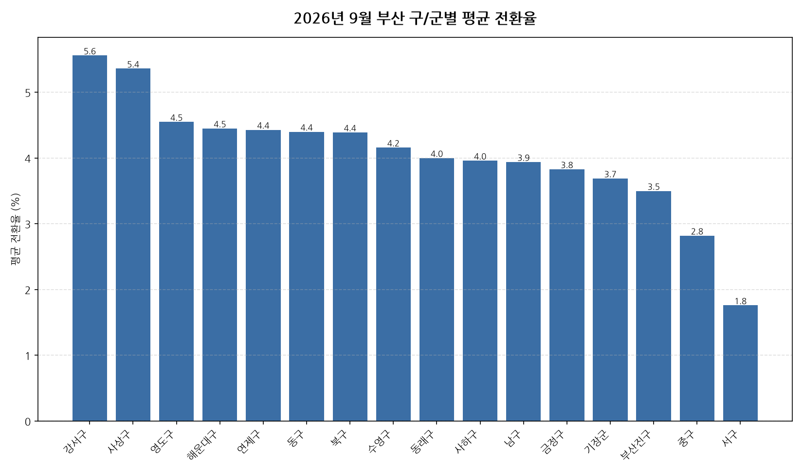

공공데이터포털의 국토교통부 아파트 전월세 실거래자료를 파이썬으로 직접 수집·분석해
2026년 9월 부산 아파트 반전세(전월세 전환) 시장 흐름을 정리했습니다.

## 분석 방법

- 데이터 출처: [국토교통부 아파트 전월세 실거래자료](https://www.data.go.kr/data/15126474/openapi.do) (공공데이터포털 Open API)
- 분석 대상: 부산 16개 구/군, 2026년 9월 신고 기준 반전세(전월세 전환) 계약
- 비교 기준월: 2026년 8월 (전월 대비 증감률 계산용)
- 실거래 신고는 계약 후 30일 이내에 이루어지므로, 최근월 데이터는 이후 계속 소폭 갱신될 수 있습니다.
- 전월세 전환율은 실제 시세 대신 같은 자치구·같은 달의 순수 전세 평균 보증금을 기준가로 삼아 추정한 값입니다(연 환산 %).

## 2026년 9월 부산 아파트 전월세 전환율 분석 · 구/군별 평균 전환율

| 구/군 | 평균 전환율 | 중위 전환율 | 거래건수 |
|---|---:|---:|---:|
| 강서구 | 5.6 | 6.0 | 109 |
| 사상구 | 5.4 | 4.0 | 60 |
| 영도구 | 4.5 | 3.4 | 33 |
| 해운대구 | 4.5 | 2.8 | 168 |
| 연제구 | 4.4 | 3.9 | 78 |
| 동구 | 4.4 | 2.9 | 11 |
| 북구 | 4.4 | 3.1 | 103 |
| 수영구 | 4.2 | 2.6 | 90 |
| 동래구 | 4.0 | 3.1 | 84 |
| 사하구 | 4.0 | 3.4 | 70 |
| 남구 | 3.9 | 4.0 | 88 |
| 금정구 | 3.8 | 2.6 | 38 |
| 기장군 | 3.7 | 3.2 | 79 |
| 부산진구 | 3.5 | 2.3 | 235 |
| 중구 | 2.8 | 3.9 | 5 |
| 서구 | 1.8 | 0.9 | 69 |

## 2026년 9월 부산 아파트 전월세 전환율 분석 · 구/군별 인사이트

- 2026년 9월 부산 아파트 반전세(전월세 전환) 평균 전환율은 약 4.1%으로, 전월 대비 3.0% 상승했습니다.
- 16개 구/군 중 평균 전환율이 가장 높은 곳은 강서구(약 5.6%)이었고, 가장 낮은 곳은 서구(약 1.8%)이었습니다.
- 거래량 기준으로는 부산진구에서 235건으로 가장 활발하게 반전세(전월세 전환) 계약이 체결됐습니다.
- 2026년 9월 부산에서 신고된 반전세(전월세 전환) 계약은 총 1320건입니다 (같은 자치구·같은 달 순수 전세 평균가 대비 환산한 추정치이며, 전환율이 0% 이하이거나 30%를 넘는 이상치는 제외).
