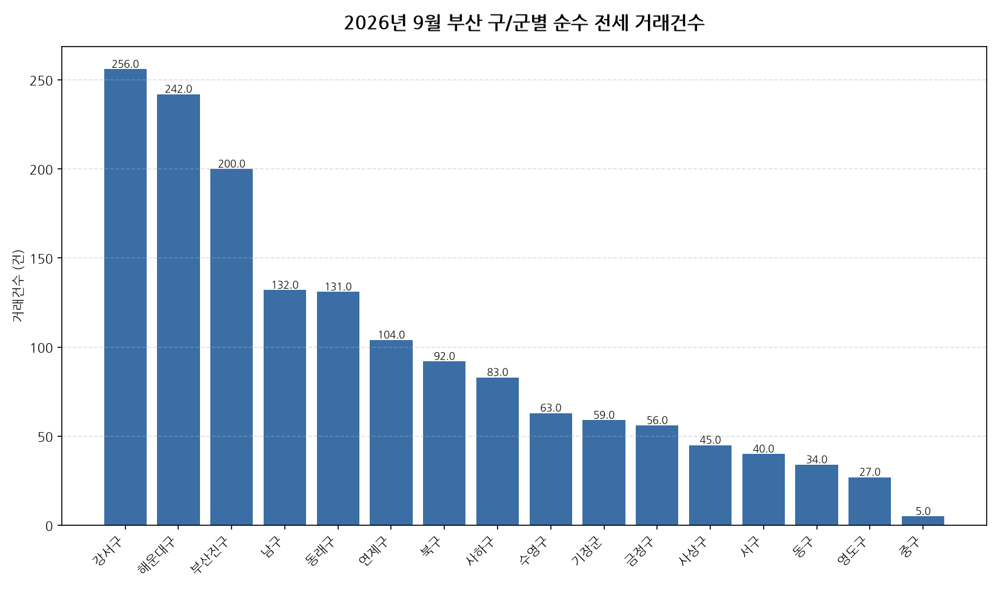

공공데이터포털의 국토교통부 아파트 전월세 실거래자료를 파이썬으로 직접 수집·분석해
2026년 9월 부산 아파트 순수 전세 거래량과 가격 변동률 사이의 관계를 살펴봤습니다.

## 분석 방법

- 데이터 출처: [국토교통부 아파트 전월세 실거래자료](https://www.data.go.kr/data/15126474/openapi.do) (공공데이터포털 Open API)
- 분석 대상: 부산 16개 구/군, 2026년 9월 신고 기준 순수 전세 계약
- 비교 기준월: 2026년 8월 (전월 대비 가격 변동률 계산용)
- 가격 변동률은 구/군별 평균 전세보증금 기준이며, 거래건수는 순수 전세 계약 건수 기준입니다.

## 2026년 9월 부산 아파트 전세 거래량과 가격 변동의 관계 · 구/군별 거래건수와 가격 변동률

| 구/군 | 거래건수 | 가격변동률(전월 대비) |
|---|---:|---:|
| 강서구 | 256 | +2.5% |
| 해운대구 | 242 | +5.8% |
| 부산진구 | 200 | +2.4% |
| 남구 | 132 | +6.3% |
| 동래구 | 131 | -6.4% |
| 연제구 | 104 | -0.0% |
| 북구 | 92 | +11.9% |
| 사하구 | 83 | +10.1% |
| 수영구 | 63 | -16.8% |
| 기장군 | 59 | +2.8% |
| 금정구 | 56 | -14.7% |
| 사상구 | 45 | -15.2% |
| 서구 | 40 | +13.3% |
| 동구 | 34 | -11.3% |
| 영도구 | 27 | -5.6% |
| 중구 | 5 | -18.6% |

## 2026년 9월 부산 아파트 전세 거래량과 가격 변동의 관계 · 구/군별 인사이트

- 2026년 9월 부산 16개 구/군 중 순수 전세 거래가 가장 활발한 곳은 강서구(256건)이었습니다.
- 전월 대비 평균 전세보증금이 가장 많이 오른 곳은 서구(+13.3%), 가장 많이 내린 곳은 중구(-18.6%)이었습니다.
- 거래건수와 가격 변동률의 상관계수는 0.43로, 약한 비례(거래가 많을수록 가격도 더 올랐음) 관계를 보였습니다.
- 상관관계는 인과관계를 의미하지 않으며, 표본 수가 적은 구/군은 결과가 왜곡될 수 있습니다.

---

이런 데이터를 직접 파이썬으로 분석해보고 싶으신 분들을 위해, 공공데이터포털 아파트 매매/전월세 데이터를 분석하는 방법을 담은 전자책 《파이썬을 활용한 부동산 시장 분석_아파트편》을 준비했어요. 2026년 데이터를 기준으로 다루고 있고, 교보문고에서 만나보실 수 있어요: https://ebook-product.kyobobook.co.kr/dig/epd/ebook/480D250151380
