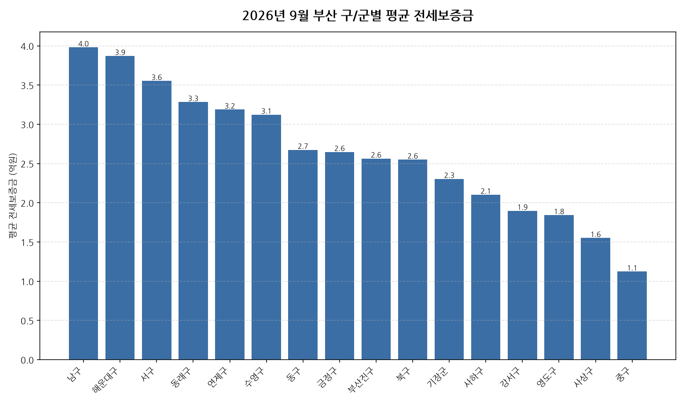

공공데이터포털의 국토교통부 아파트 전월세 실거래자료를 파이썬으로 직접 수집·분석해
2026년 9월 부산 아파트 순수 전세 시장 흐름을 정리했습니다.

## 분석 방법

- 데이터 출처: [국토교통부 아파트 전월세 실거래자료](https://www.data.go.kr/data/15126474/openapi.do) (공공데이터포털 Open API)
- 분석 대상: 부산 16개 구/군, 2026년 9월 신고 기준 순수 전세 계약
- 비교 기준월: 2025년 9월 (전년 동월 대비 증감률 계산용)
- 실거래 신고는 계약 후 30일 이내에 이루어지므로, 최근월 데이터는 이후 계속 소폭 갱신될 수 있습니다.

## 2026년 9월 부산 아파트 전세가, 1년 전과 비교하면 · 구/군별 평균 전세보증금

| 구/군 | 평균 전세보증금 | 중위 전세보증금 | 거래건수 |
|---|---:|---:|---:|
| 남구 | 4.0 | 3.5 | 139 |
| 해운대구 | 3.9 | 3.1 | 246 |
| 서구 | 3.6 | 3.5 | 42 |
| 동래구 | 3.3 | 3.2 | 135 |
| 연제구 | 3.2 | 3.1 | 106 |
| 수영구 | 3.1 | 3.0 | 66 |
| 동구 | 2.7 | 2.9 | 34 |
| 금정구 | 2.6 | 2.7 | 61 |
| 부산진구 | 2.6 | 2.5 | 202 |
| 북구 | 2.6 | 2.6 | 94 |
| 기장군 | 2.3 | 2.4 | 60 |
| 사하구 | 2.1 | 1.9 | 86 |
| 강서구 | 1.9 | 1.5 | 258 |
| 영도구 | 1.8 | 1.7 | 27 |
| 사상구 | 1.6 | 1.4 | 46 |
| 중구 | 1.1 | 1.2 | 5 |

## 2026년 9월 부산 아파트 전세가, 1년 전과 비교하면 · 구/군별 인사이트

- 2026년 9월 부산 아파트 순수 전세 평균 전세보증금은 약 2.9억원으로, 전년 동월 대비 10.4% 상승했습니다.
- 16개 구/군 중 평균 전세보증금이 가장 높은 곳은 남구(약 4.0억원)이었고, 가장 낮은 곳은 중구(약 1.1억원)이었습니다.
- 거래량 기준으로는 강서구에서 258건으로 가장 활발하게 순수 전세 계약이 체결됐습니다.
- 2026년 9월 부산에서 신고된 순수 전세 계약은 총 1607건입니다 (월세를 낀 반전세/월세 계약은 제외).
