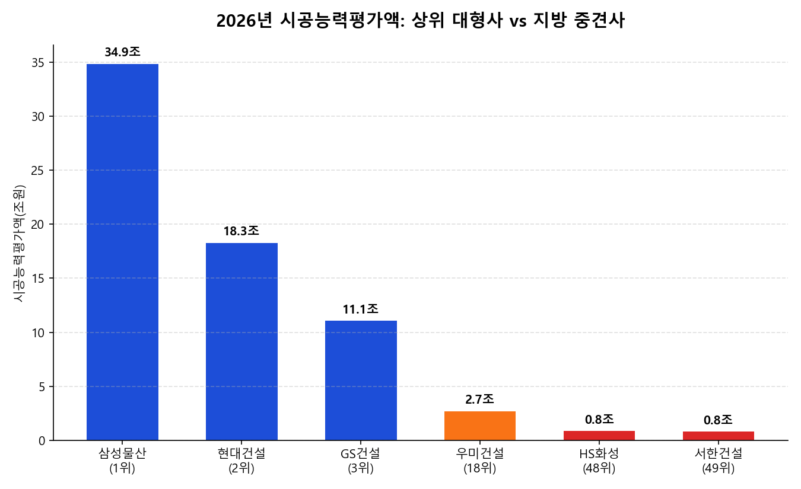

매년 여름 발표되는 시공능력평가 순위는 단순한 '건설사 서열표'가 아니라, 공공입찰 참가 자격과 신용도에
직결되는 지표입니다. 2026년 평가 결과를 보면 상위 대형사와 지방 중견사의 격차가 숫자로 뚜렷하게 드러납니다.

## 시공능력평가란 무엇이고 왜 중요할까

시공능력평가는 국토교통부가 매년 대한건설협회를 통해 발표하는 지표로, 공사 실적·경영 상태·기술 능력·신인도를
종합해 건설사별 시공 능력을 금액으로 환산한 것입니다. 이 순위는 공공공사 입찰 참가 자격, 관급공사 수주,
금융기관 여신 심사에까지 영향을 미쳐 건설사 입장에서는 실적만큼이나 민감한 지표입니다.
2026년에는 전국 74,332개 건설업체가 평가 대상이 됐습니다.

## 2026년 상위 건설사, 순위는 어떻게 갈렸나

토목건축공사업 기준 상위 5개사의 시공능력평가액은 다음과 같습니다.

| 순위 | 건설사 | 시공능력평가액 |
|---:|---|---:|
| 1 | 삼성물산 | 34조 8,785억원 |
| 2 | 현대건설 | 18조 2,714억원 |
| 3 | GS건설 | 11조 668억원 |
| 4 | 현대엔지니어링 | 11조 53억원 |
| 5 | 대우건설 | 9조 9,249억원 |

6~10위권에는 DL이앤씨, 롯데건설, 포스코이앤씨, SK에코플랜트, HDC현대산업개발이 이름을 올리며 상위 10위 안에서도
순위 재편이 있었습니다. 1위 삼성물산과 2위 현대건설의 격차는 지난해보다 다소 줄었지만, 여전히 약 1.9배 차이가
나는 압도적인 1강 구도입니다.

## 지방 중견 건설사는 얼마나 정체됐나

같은 평가에서 지방 기반 중견 건설사들의 흐름은 사뭇 다릅니다.

| 건설사 | 2025년 순위 | 2026년 순위 | 2026년 평가액 | 비고 |
|---|---:|---:|---:|---|
| 우미건설 | 21위 | 18위 | 2조 6,912억원 | 2년 연속 역대 최고 순위 경신 |
| HS화성 | 대구 1위 | 전국 48위 (대구 1위 유지) | 8,325억원 | 22년 연속 대구 지역 1위 |
| 서한건설 | 50위 | 49위 | 7,985억원 | 상위 50위권 안착 |

우미건설은 3계단 오르며 선전했지만, HS화성은 '22년 연속 대구 1위'라는 타이틀이 오히려 정체를 보여줍니다.
지역 1위 자리를 20년 넘게 지키고 있다는 건 역설적으로 그 이상으로는 못 올라가고 있다는 뜻이기도 합니다.

## 숫자로 보는 격차 — 1위와 18위, 48위는 몇 배 차이일까

- 삼성물산(1위, 34조 8,785억원) vs 우미건설(18위, 2조 6,912억원) → **약 13.0배**
- 삼성물산 vs HS화성(48위, 8,325억원) → **약 41.9배**
- 삼성물산 vs 서한건설(49위, 7,985억원) → **약 43.7배**

TOP 20 안에 드는 우미건설조차 1위와 13배 차이가 나고, TOP 50 안팎의 지방 대표 건설사들은 40배 넘게 벌어집니다.
같은 '건설업'이라는 카테고리로 묶여 있을 뿐, 사실상 체급이 다른 두 시장이라고 봐야 할 정도의 격차입니다.

## 왜 격차가 좁혀지지 않을까 — 브랜드타운 전략

대형사들이 격차를 계속 벌리는 배경에는 '브랜드타운' 전략이 있습니다. 한 지역의 정비사업을 대형사 몇 곳이
연달아 수주해 동네 전체를 특정 브랜드 아파트로 채우는 방식입니다.

- 안양 비산동: 대우건설·삼성물산·GS건설·HDC현대산업개발이 재개발을 통해 브랜드타운을 형성했고, 관련 단지들이 전 타입 1순위 마감을 기록
- 부산 연산동: 롯데캐슬골드포레(1,230가구)·힐스테이트 연산(1,651가구)·연산더샵(1,071가구) 등 대형 3사 브랜드 단지가 밀집
- 평택 고덕국제신도시: 현대건설이 6개 블록, 총 4,500여 가구 규모의 '힐스테이트' 브랜드타운을 조성 예정

브랜드타운으로 자리 잡은 지역의 청약 경쟁률은 비브랜드 단지 대비 약 4배에 달한다는 조사도 있습니다.
분양 흥행이 곧 다음 정비사업 수주로 이어지는 선순환 구조가 만들어지면서, 브랜드력이 없는 지방 중견사는
애초에 같은 링에 오르기 어려운 구조입니다.

## 통계로 확인되는 지방 건설업 위기

시공능력평가 순위 정체보다 더 심각한 건 지방 중소 건설사들의 생존 지표입니다.

- 2025년(1월 1일~12월 10일 집계) 종합공사업체 폐업 건수는 610곳으로, 2005년 관련 통계 작성 이후 역대 최대치를 기록했습니다. 이는 금융위기였던 2008년(464건)보다도 많은 수치입니다.
- 폐업 신고 10건 중 6건이 비수도권(지방)에서 발생했습니다.
- 2024년에는 건설사 부도가 26곳 발생해 2019년 이후 최다를 기록했습니다.
- 원인으로는 고금리 장기화와 부동산 PF 대출 만기 연장 중단에 따른 유동성 위기가 꼽힙니다.

시평 순위표에서는 상위권과 하위권의 '격차'로만 보이던 것이, 실제로는 지방 건설업체 상당수가 아예 시장에서
퇴출되고 있는 '생존 문제'로 이어지고 있다는 뜻입니다.

## 내 생각

시평 순위와 폐업 통계를 같이 놓고 보면, 지방 중견 건설사의 정체를 단순히 '경영을 못해서'로 설명하기는 어렵다는
생각이 듭니다. HS화성처럼 22년째 지역 1위를 지키는 회사조차 전국 순위는 48위에 머물러 있다는 건, 개별 기업의
역량보다는 브랜드 선호·정비사업 수주 쏠림·자금 조달력 격차라는 구조적 요인이 더 크게 작용한다는 신호로 보입니다.

특히 브랜드타운 전략은 대형사에게는 합리적인 선택이지만, 시장 전체로 보면 특정 브랜드에 대한 의존도를 높여
분양가나 공사비 협상력에서 소비자가 불리해질 여지를 만듭니다. 동시에 지방 중소 건설사가 위축되면 해당 지역의
고용과 하도급 생태계에도 영향을 줄 수밖에 없습니다.

지방 건설사 입장에서는 대형사와 같은 방식(전국 확장, 브랜드 경쟁)으로 승부하기보다, 지역 내 알짜 사업과
틈새시장에 집중하는 전략이 오히려 현실적인 생존법일 수 있습니다. 다만 610건이라는 역대 최대 폐업 수치는
개별 기업의 전략 문제를 넘어선 위기 국면에 들어섰다는 신호로 읽힙니다. 이 흐름이 정책적으로 어떻게
조정될지는 계속 지켜볼 필요가 있습니다.

---

**참고 자료**
- 국토교통부·대한건설협회 2026년 시공능력평가 발표 자료
- 관련 업계 보도(시공능력평가 순위, 지방 건설사 폐업 통계, 브랜드타운 사례)
