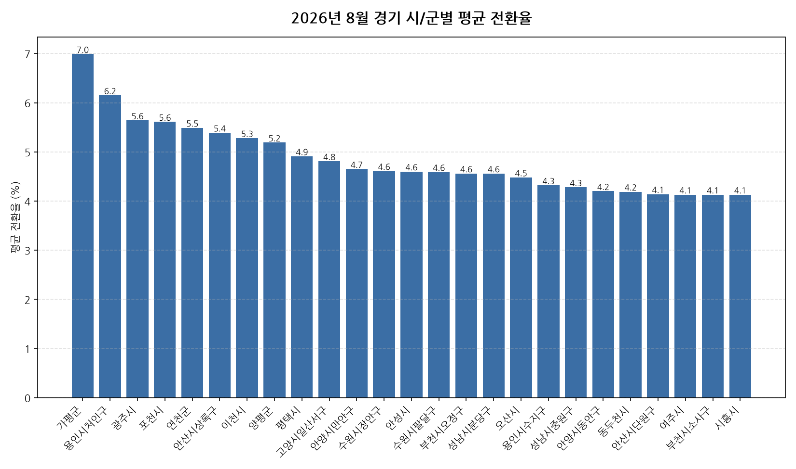

공공데이터포털의 국토교통부 아파트 전월세 실거래자료를 파이썬으로 직접 수집·분석해
2026년 8월 경기 아파트 반전세(전월세 전환) 시장 흐름을 정리했습니다.

## 분석 방법

- 데이터 출처: [국토교통부 아파트 전월세 실거래자료](https://www.data.go.kr/data/15126474/openapi.do) (공공데이터포털 Open API)
- 분석 대상: 경기 44개 시/군, 2026년 8월 신고 기준 반전세(전월세 전환) 계약
- 비교 기준월: 2026년 7월 (전월 대비 증감률 계산용)
- 실거래 신고는 계약 후 30일 이내에 이루어지므로, 최근월 데이터는 이후 계속 소폭 갱신될 수 있습니다.
- 전월세 전환율은 실제 시세 대신 같은 자치구·같은 달의 순수 전세 평균 보증금을 기준가로 삼아 추정한 값입니다(연 환산 %).

## 2026년 8월 경기 아파트 전월세 전환율 분석 · 시/군별 평균 전환율

| 시/군 | 평균 전환율 | 중위 전환율 | 거래건수 |
|---|---:|---:|---:|
| 가평군 | 7.0 | 7.0 | 9 |
| 용인시처인구 | 6.2 | 5.9 | 173 |
| 광주시 | 5.6 | 5.5 | 101 |
| 포천시 | 5.6 | 6.0 | 43 |
| 연천군 | 5.5 | 4.5 | 15 |
| 안산시상록구 | 5.4 | 4.5 | 82 |
| 이천시 | 5.3 | 4.4 | 143 |
| 양평군 | 5.2 | 5.3 | 28 |
| 평택시 | 4.9 | 4.1 | 875 |
| 고양시일산서구 | 4.8 | 4.1 | 158 |
| 안양시만안구 | 4.7 | 3.1 | 71 |
| 수원시장안구 | 4.6 | 3.9 | 105 |
| 안성시 | 4.6 | 4.3 | 311 |
| 수원시팔달구 | 4.6 | 2.6 | 119 |
| 부천시오정구 | 4.6 | 3.6 | 39 |
| 성남시분당구 | 4.6 | 3.0 | 295 |
| 오산시 | 4.5 | 4.1 | 137 |
| 용인시수지구 | 4.3 | 4.3 | 241 |
| 성남시중원구 | 4.3 | 3.5 | 91 |
| 안양시동안구 | 4.2 | 3.0 | 233 |
| 동두천시 | 4.2 | 3.6 | 82 |
| 안산시단원구 | 4.1 | 3.5 | 152 |
| 여주시 | 4.1 | 3.1 | 58 |
| 부천시소사구 | 4.1 | 3.5 | 88 |
| 시흥시 | 4.1 | 3.7 | 352 |
| 과천시 | 4.0 | 2.8 | 48 |
| 구리시 | 4.0 | 3.6 | 101 |
| 양주시 | 3.9 | 3.5 | 402 |
| 광명시 | 3.9 | 2.7 | 156 |
| 하남시 | 3.7 | 1.9 | 331 |
| 의정부시 | 3.7 | 2.7 | 371 |
| 고양시덕양구 | 3.6 | 2.6 | 273 |
| 수원시영통구 | 3.6 | 2.4 | 243 |
| 고양시일산동구 | 3.6 | 2.6 | 120 |
| 군포시 | 3.5 | 3.0 | 116 |
| 용인시기흥구 | 3.4 | 2.0 | 280 |
| 성남시수정구 | 3.3 | 2.4 | 167 |
| 의왕시 | 3.3 | 2.5 | 100 |
| 부천시원미구 | 3.3 | 2.5 | 175 |
| 남양주시 | 3.2 | 1.3 | 525 |
| 김포시 | 3.0 | 2.5 | 429 |
| 파주시 | 2.8 | 1.5 | 635 |
| 수원시권선구 | 2.7 | 2.9 | 377 |

## 2026년 8월 경기 아파트 전월세 전환율 분석 · 시/군별 인사이트

- 2026년 8월 경기 아파트 반전세(전월세 전환) 평균 전환율은 약 4.0%으로, 전월 대비 3.5% 하락했습니다.
- 44개 시/군 중 평균 전환율이 가장 높은 곳은 가평군(약 7.0%)이었고, 가장 낮은 곳은 수원시권선구(약 2.7%)이었습니다.
- 거래량 기준으로는 평택시에서 875건으로 가장 활발하게 반전세(전월세 전환) 계약이 체결됐습니다.
- 2026년 8월 경기에서 신고된 반전세(전월세 전환) 계약은 총 8850건입니다 (같은 자치구·같은 달 순수 전세 평균가 대비 환산한 추정치이며, 전환율이 0% 이하이거나 30%를 넘는 이상치는 제외).
