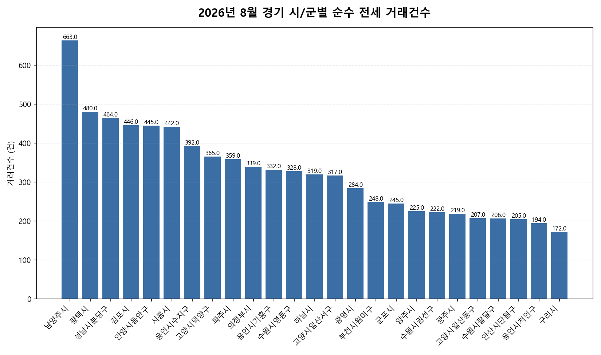

공공데이터포털의 국토교통부 아파트 전월세 실거래자료를 파이썬으로 직접 수집·분석해
2026년 8월 경기 아파트 순수 전세 거래량과 가격 변동률 사이의 관계를 살펴봤습니다.

## 분석 방법

- 데이터 출처: [국토교통부 아파트 전월세 실거래자료](https://www.data.go.kr/data/15126474/openapi.do) (공공데이터포털 Open API)
- 분석 대상: 경기 44개 시/군, 2026년 8월 신고 기준 순수 전세 계약
- 비교 기준월: 2026년 7월 (전월 대비 가격 변동률 계산용)
- 가격 변동률은 시/군별 평균 전세보증금 기준이며, 거래건수는 순수 전세 계약 건수 기준입니다.

## 2026년 8월 경기 아파트 전세 거래량과 가격 변동의 관계 · 시/군별 거래건수와 가격 변동률

| 시/군 | 거래건수 | 가격변동률(전월 대비) |
|---|---:|---:|
| 남양주시 | 663 | -1.8% |
| 평택시 | 480 | -1.1% |
| 성남시분당구 | 464 | +0.7% |
| 김포시 | 446 | -0.4% |
| 안양시동안구 | 445 | -1.1% |
| 시흥시 | 442 | -0.2% |
| 용인시수지구 | 392 | -0.3% |
| 고양시덕양구 | 365 | -0.4% |
| 파주시 | 359 | +1.2% |
| 의정부시 | 339 | +0.7% |
| 용인시기흥구 | 332 | -0.0% |
| 수원시영통구 | 328 | +2.8% |
| 하남시 | 319 | -1.5% |
| 고양시일산서구 | 317 | +3.2% |
| 광명시 | 284 | -1.1% |
| 부천시원미구 | 248 | +0.5% |
| 군포시 | 245 | +2.0% |
| 양주시 | 225 | +7.1% |
| 수원시권선구 | 222 | -0.2% |
| 광주시 | 219 | -3.0% |
| 고양시일산동구 | 207 | +7.2% |
| 수원시팔달구 | 206 | -2.4% |
| 안산시단원구 | 205 | +3.0% |
| 용인시처인구 | 194 | -8.9% |
| 구리시 | 172 | -3.4% |
| 수원시장안구 | 163 | +3.0% |
| 안성시 | 161 | -8.2% |
| 오산시 | 160 | +0.6% |
| 성남시수정구 | 158 | -3.0% |
| 안양시만안구 | 151 | +1.3% |
| 이천시 | 134 | -0.2% |
| 안산시상록구 | 125 | +2.8% |
| 성남시중원구 | 123 | +2.2% |
| 부천시소사구 | 103 | +1.1% |
| 의왕시 | 94 | -3.0% |
| 과천시 | 69 | -6.3% |
| 부천시오정구 | 46 | +11.7% |
| 양평군 | 44 | +20.5% |
| 동두천시 | 38 | +3.7% |
| 여주시 | 36 | +9.9% |
| 포천시 | 28 | +9.4% |
| 가평군 | 13 | +1.9% |
| 연천군 | 4 | -29.1% |

## 2026년 8월 경기 아파트 전세 거래량과 가격 변동의 관계 · 시/군별 인사이트

- 2026년 8월 경기 44개 시/군 중 순수 전세 거래가 가장 활발한 곳은 남양주시(663건)이었습니다.
- 전월 대비 평균 전세보증금이 가장 많이 오른 곳은 양평군(+20.5%), 가장 많이 내린 곳은 연천군(-29.1%)이었습니다.
- 거래건수와 가격 변동률의 상관계수는 -0.08로, 거의 없는 반비례(거래가 많을수록 가격이 더 내렸음) 관계를 보였습니다.
- 상관관계는 인과관계를 의미하지 않으며, 표본 수가 적은 시/군은 결과가 왜곡될 수 있습니다.
