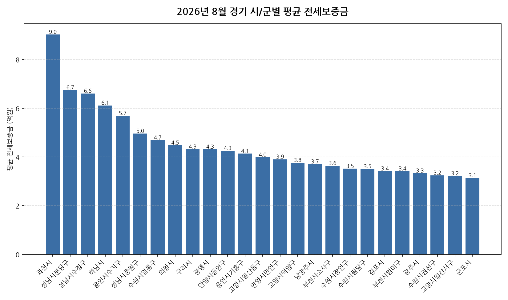

공공데이터포털의 국토교통부 아파트 전월세 실거래자료를 파이썬으로 직접 수집·분석해
2026년 8월 경기 아파트 순수 전세 시장 흐름을 정리했습니다.

## 분석 방법

- 데이터 출처: [국토교통부 아파트 전월세 실거래자료](https://www.data.go.kr/data/15126474/openapi.do) (공공데이터포털 Open API)
- 분석 대상: 경기 44개 시/군, 2026년 8월 신고 기준 순수 전세 계약
- 비교 기준월: 2025년 8월 (전년 동월 대비 증감률 계산용)
- 실거래 신고는 계약 후 30일 이내에 이루어지므로, 최근월 데이터는 이후 계속 소폭 갱신될 수 있습니다.

## 2026년 8월 경기 아파트 전세가, 1년 전과 비교하면 · 시/군별 평균 전세보증금

| 시/군 | 평균 전세보증금 | 중위 전세보증금 | 거래건수 |
|---|---:|---:|---:|
| 과천시 | 9.0 | 9.0 | 70 |
| 성남시분당구 | 6.7 | 6.7 | 475 |
| 성남시수정구 | 6.6 | 6.7 | 160 |
| 하남시 | 6.1 | 6.2 | 327 |
| 용인시수지구 | 5.7 | 5.6 | 396 |
| 성남시중원구 | 5.0 | 5.2 | 124 |
| 수원시영통구 | 4.7 | 3.9 | 332 |
| 의왕시 | 4.5 | 4.5 | 95 |
| 구리시 | 4.3 | 4.3 | 175 |
| 광명시 | 4.3 | 3.8 | 286 |
| 안양시동안구 | 4.3 | 4.2 | 454 |
| 용인시기흥구 | 4.1 | 4.1 | 335 |
| 고양시일산동구 | 4.0 | 4.1 | 209 |
| 안양시만안구 | 3.9 | 3.7 | 154 |
| 고양시덕양구 | 3.8 | 3.6 | 373 |
| 남양주시 | 3.7 | 3.5 | 675 |
| 부천시소사구 | 3.6 | 3.7 | 106 |
| 수원시장안구 | 3.5 | 3.3 | 165 |
| 수원시팔달구 | 3.5 | 3.6 | 212 |
| 김포시 | 3.4 | 3.3 | 452 |
| 부천시원미구 | 3.4 | 3.0 | 252 |
| 광주시 | 3.3 | 3.2 | 223 |
| 수원시권선구 | 3.2 | 3.1 | 225 |
| 고양시일산서구 | 3.2 | 3.0 | 319 |
| 군포시 | 3.1 | 2.8 | 256 |
| 양평군 | 3.0 | 2.9 | 45 |
| 안산시단원구 | 2.9 | 3.0 | 208 |
| 파주시 | 2.9 | 3.0 | 363 |
| 시흥시 | 2.8 | 2.8 | 448 |
| 의정부시 | 2.7 | 2.6 | 341 |
| 오산시 | 2.6 | 2.6 | 166 |
| 용인시처인구 | 2.5 | 2.5 | 199 |
| 부천시오정구 | 2.4 | 2.3 | 46 |
| 안산시상록구 | 2.4 | 2.3 | 127 |
| 양주시 | 2.3 | 2.3 | 225 |
| 여주시 | 2.2 | 2.4 | 37 |
| 평택시 | 2.1 | 2.2 | 487 |
| 이천시 | 2.1 | 2.0 | 136 |
| 가평군 | 1.9 | 1.9 | 13 |
| 안성시 | 1.7 | 1.9 | 163 |
| 포천시 | 1.6 | 1.8 | 28 |
| 동두천시 | 1.4 | 1.4 | 39 |
| 연천군 | 1.1 | 1.1 | 4 |

## 2026년 8월 경기 아파트 전세가, 1년 전과 비교하면 · 시/군별 인사이트

- 2026년 8월 경기 아파트 순수 전세 평균 전세보증금은 약 3.8억원으로, 전년 동월 대비 6.0% 상승했습니다.
- 44개 시/군 중 평균 전세보증금이 가장 높은 곳은 과천시(약 9.0억원)이었고, 가장 낮은 곳은 연천군(약 1.1억원)이었습니다.
- 거래량 기준으로는 남양주시에서 675건으로 가장 활발하게 순수 전세 계약이 체결됐습니다.
- 2026년 8월 경기에서 신고된 순수 전세 계약은 총 9925건입니다 (월세를 낀 반전세/월세 계약은 제외).

---

이런 데이터를 직접 파이썬으로 분석해보고 싶으신 분들을 위해, 공공데이터포털 아파트 매매/전월세 데이터를 분석하는 방법을 담은 전자책 《파이썬을 활용한 부동산 시장 분석_아파트편》을 준비했어요. 2026년 데이터를 기준으로 다루고 있고, 교보문고에서 만나보실 수 있어요: https://ebook-product.kyobobook.co.kr/dig/epd/ebook/480D250151380
