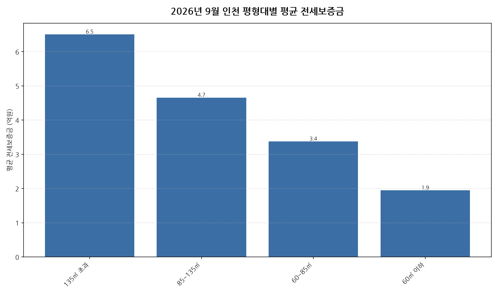

공공데이터포털의 국토교통부 아파트 전월세 실거래자료를 파이썬으로 직접 수집·분석해
2026년 9월 인천 아파트 순수 전세 시장 흐름을 정리했습니다.

## 분석 방법

- 데이터 출처: [국토교통부 아파트 전월세 실거래자료](https://www.data.go.kr/data/15126474/openapi.do) (공공데이터포털 Open API)
- 분석 대상: 인천 4개 평형대 구간, 2026년 9월 신고 기준 순수 전세 계약
- 비교 기준월: 2026년 8월 (전월 대비 증감률 계산용)
- 실거래 신고는 계약 후 30일 이내에 이루어지므로, 최근월 데이터는 이후 계속 소폭 갱신될 수 있습니다.

## 2026년 9월 인천 아파트 평형대별 전세가 분석 · 평형대별 평균 전세보증금

| 평형대 | 평균 전세보증금 | 중위 전세보증금 | 거래건수 |
|---|---:|---:|---:|
| 135㎡ 초과 | 6.5 | 5.2 | 15 |
| 85~135㎡ | 4.7 | 4.7 | 129 |
| 60~85㎡ | 3.4 | 3.5 | 436 |
| 60㎡ 이하 | 1.9 | 1.8 | 501 |

## 2026년 9월 인천 아파트 평형대별 전세가 분석 · 평형대별 인사이트

- 2026년 9월 인천 아파트 순수 전세 평균 전세보증금은 약 2.9억원으로, 전월 대비 1.8% 하락했습니다.
- 4개 평형대 구간 중 평균 전세보증금이 가장 높은 구간은 135㎡ 초과(약 6.5억원)이었고, 가장 낮은 구간은 60㎡ 이하(약 1.9억원)이었습니다.
- 거래량 기준으로는 60㎡ 이하에서 501건으로 가장 활발하게 순수 전세 계약이 체결됐습니다.
- 2026년 9월 인천에서 신고된 순수 전세 계약은 총 1081건입니다 (월세를 낀 반전세/월세 계약은 제외).
