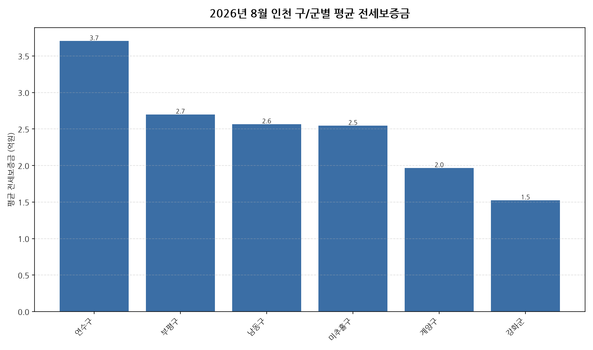

공공데이터포털의 국토교통부 아파트 전월세 실거래자료를 파이썬으로 직접 수집·분석해
2026년 8월 인천 아파트 순수 전세 시장 흐름을 정리했습니다.

## 분석 방법

- 데이터 출처: [국토교통부 아파트 전월세 실거래자료](https://www.data.go.kr/data/15126474/openapi.do) (공공데이터포털 Open API)
- 분석 대상: 인천 10개 구/군, 2026년 8월 신고 기준 순수 전세 계약
- 비교 기준월: 2026년 7월 (전월 대비 증감률 계산용)
- 실거래 신고는 계약 후 30일 이내에 이루어지므로, 최근월 데이터는 이후 계속 소폭 갱신될 수 있습니다.

## 2026년 8월 인천 아파트 전세가 동향 · 구/군별 평균 전세보증금

| 구/군 | 평균 전세보증금 | 중위 전세보증금 | 거래건수 |
|---|---:|---:|---:|
| 연수구 | 3.7 | 3.7 | 532 |
| 부평구 | 2.7 | 2.5 | 278 |
| 남동구 | 2.6 | 2.7 | 231 |
| 미추홀구 | 2.5 | 2.8 | 124 |
| 계양구 | 2.0 | 1.7 | 176 |
| 강화군 | 1.5 | 1.5 | 2 |

## 2026년 8월 인천 아파트 전세가 동향 · 구/군별 인사이트

- 2026년 8월 인천 아파트 순수 전세 평균 전세보증금은 약 3.0억원으로, 전월 대비 2.9% 상승했습니다.
- 10개 구/군 중 평균 전세보증금이 가장 높은 곳은 연수구(약 3.7억원)이었고, 가장 낮은 곳은 강화군(약 1.5억원)이었습니다.
- 거래량 기준으로는 연수구에서 532건으로 가장 활발하게 순수 전세 계약이 체결됐습니다.
- 2026년 8월 인천에서 신고된 순수 전세 계약은 총 1343건입니다 (월세를 낀 반전세/월세 계약은 제외).
