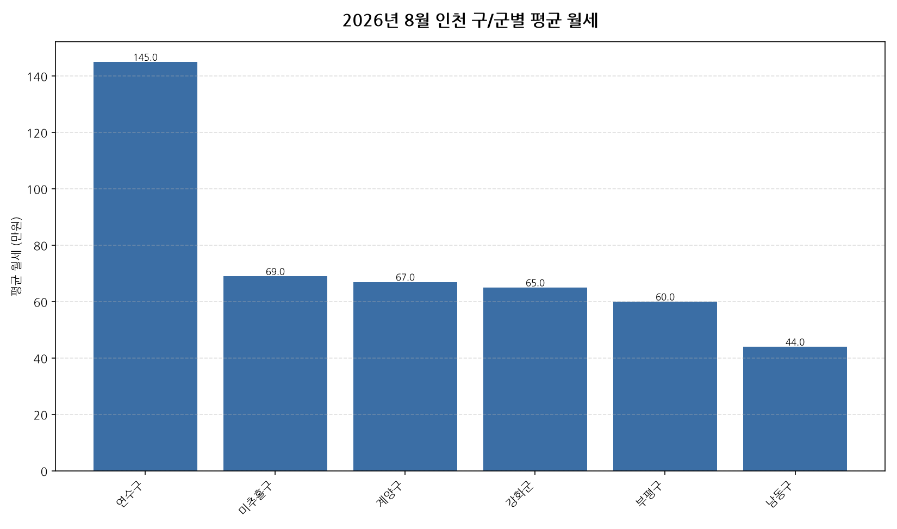

공공데이터포털의 국토교통부 아파트 전월세 실거래자료를 파이썬으로 직접 수집·분석해
2026년 8월 인천 아파트 월세(반전세 포함) 시장 흐름을 정리했습니다.

## 분석 방법

- 데이터 출처: [국토교통부 아파트 전월세 실거래자료](https://www.data.go.kr/data/15126474/openapi.do) (공공데이터포털 Open API)
- 분석 대상: 인천 10개 구/군, 2026년 8월 신고 기준 월세(반전세 포함) 계약
- 비교 기준월: 2026년 7월 (전월 대비 증감률 계산용)
- 실거래 신고는 계약 후 30일 이내에 이루어지므로, 최근월 데이터는 이후 계속 소폭 갱신될 수 있습니다.

## 2026년 8월 인천 아파트 월세 시장 동향 · 구/군별 평균 월세

| 구/군 | 평균 월세 | 중위 월세 | 거래건수 |
|---|---:|---:|---:|
| 연수구 | 145.0 | 140.0 | 330 |
| 미추홀구 | 69.0 | 55.0 | 163 |
| 계양구 | 67.0 | 60.0 | 119 |
| 강화군 | 65.0 | 70.0 | 14 |
| 부평구 | 60.0 | 50.0 | 458 |
| 남동구 | 44.0 | 30.0 | 398 |

## 2026년 8월 인천 아파트 월세 시장 동향 · 구/군별 인사이트

- 2026년 8월 인천 아파트 월세(반전세 포함) 평균 월세는 약 76.3만원으로, 전월 대비 1.9% 하락했습니다.
- 10개 구/군 중 평균 월세가 가장 높은 곳은 연수구(약 145.0만원)이었고, 가장 낮은 곳은 남동구(약 44.0만원)이었습니다.
- 거래량 기준으로는 부평구에서 458건으로 가장 활발하게 월세(반전세 포함) 계약이 체결됐습니다.
- 2026년 8월 인천에서 신고된 월세(반전세 포함) 계약은 총 1482건입니다 (순수 전세 계약은 제외).
