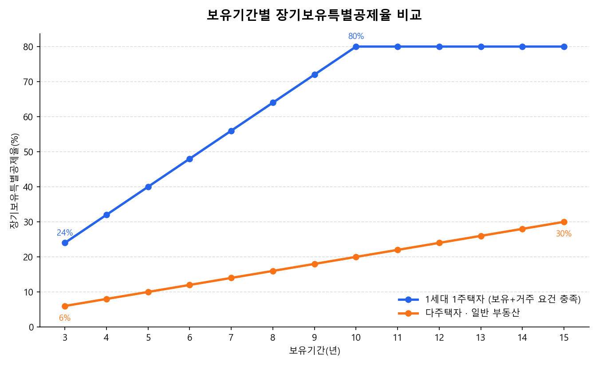

부동산 세금 뉴스를 볼 때마다 헷갈리는 이유는 세율 자체가 복잡해서가 아니라,
'보유기간·거주기간·조정대상지역 여부·주택 수'라는 네 가지 조건이 동시에 걸리기 때문입니다.
2026년 하반기 현재 기준으로 양도소득세 체계를 하나씩 표로 정리해봤습니다.

## 왜 지금 양도소득세 질문이 늘고 있을까

국세청에 접수되는 양도소득세 관련 질의가 최근 큰 폭으로 늘었다는 소식이 있었습니다.
배경을 짚어보면 두 가지 변화가 겹쳐 있습니다.

- 조정대상지역 다주택자에게 적용되던 중과세 한시 유예가 2026년 5월 9일로 종료되고, 5월 10일부터 중과가 다시 시행되고 있습니다.
- 2026년 8월 정부가 종합부동산세·양도소득세를 함께 손보는 세제개편안을 발표했고, 현재 국회 심의 대기 중입니다.

세율 자체는 최근 몇 년간 크게 바뀌지 않았지만, '유예냐 재개냐', '개편안이 통과되느냐 아니냐'에 따라
같은 집을 팔아도 세금이 크게 달라질 수 있는 상황이라 혼란이 커지고 있는 것으로 보입니다.

## 1세대 1주택 비과세, 아직도 유효할까

1세대 1주택 비과세 요건은 2026년 9월 현재 다음과 같습니다.

| 구분 | 요건 |
|---|---|
| 보유기간 | 2년 이상 |
| 거주기간 | 조정대상지역 내 취득 주택은 보유기간 중 2년 이상 거주 필요 |
| 비과세 한도 | 양도가액 12억원까지 비과세, 초과분만 안분 계산해 과세 |

여기서 자주 오해하는 부분이 '12억원 넘으면 전액 과세'라는 생각인데, 실제로는 12억원까지는 계속 비과세이고
초과하는 금액에 대해서만 과세표준을 계산합니다. 즉 15억원에 판 집이라면 12억원은 비과세, 나머지 3억원에 해당하는
비율만큼만 세금이 매겨지는 구조입니다.

## 보유기간이 세금을 얼마나 줄여줄까 — 장기보유특별공제

같은 차익이라도 얼마나 오래 보유·거주했는지에 따라 공제율이 크게 달라집니다.

| 보유기간 | 1세대 1주택자 (보유+거주 각 요건 충족 시) | 다주택자 · 일반 부동산 |
|---|---:|---:|
| 3년 | 24% | 6% |
| 5년 | 40% | 10% |
| 7년 | 56% | 14% |
| 10년 | 80% (최대) | 20% |
| 15년 이상 | 80% (동일) | 30% (최대) |

1주택자는 보유기간과 거주기간에 각각 연 4%씩 공제율이 붙어 10년을 채우면 최대 80%까지 공제받을 수 있습니다.
반면 다주택자·일반 부동산은 거주 여부와 무관하게 보유기간만으로 연 2%씩 계산되고, 15년을 채워도 최대 30%에 그칩니다.
같은 10년을 보유해도 1주택자와 다주택자의 공제율이 4배 차이 난다는 뜻입니다.

## 다주택자는 지금 세율을 얼마나 더 내나 — 중과 재개 현황

2026년 5월 10일부터 조정대상지역 다주택자 중과세가 다시 적용되고 있습니다.

| 구분 | 적용 세율 | 장기보유특별공제 |
|---|---|---|
| 1주택자 | 기본세율 | 적용 (최대 80%) |
| 조정대상지역 2주택자 | 기본세율 + 20%p | 배제 |
| 조정대상지역 3주택 이상 | 기본세율 + 30%p | 배제 |

기본세율 구간(지방소득세 10% 포함 실효세율)은 다음과 같습니다.

| 과세표준 | 기본세율 | 실효세율(지방소득세 포함) |
|---|---:|---:|
| 1,400만원 이하 | 6% | 6.6% |
| 5,000만원 이하 | 15% | 16.5% |
| 8,800만원 이하 | 24% | 26.4% |
| 1억 5천만원 이하 | 35% | 38.5% |
| 3억원 이하 | 38% | 41.8% |
| 5억원 이하 | 40% | 44.0% |
| 10억원 이하 | 42% | 46.2% |
| 10억원 초과 | 45% | 49.5% |

조정대상지역 3주택 이상이면서 과세표준이 10억원을 넘는 경우, 45%에 30%p가 더해져 최고세율이 75%(실효 82.5%)까지
올라갈 수 있고, 여기에 장기보유특별공제까지 못 받으니 체감 세부담은 표에 보이는 숫자보다 훨씬 큽니다.

## 분양권·입주권은 기준이 다르다

분양권과 입주권은 보유기간이 길어도 기본세율로 전환되지 않고 별도 세율이 고정 적용됩니다.

| 보유기간 | 세율 |
|---|---:|
| 1년 미만 | 70% |
| 1년 이상 | 60% |

일반 주택은 2년만 보유하면 기본세율 구간으로 넘어가지만, 분양권·입주권은 아무리 오래 들고 있어도
60% 세율이 유지된다는 점에서 실수요자들이 가장 많이 놓치는 함정 중 하나입니다.

## 8월 발표된 세제개편안, 아직 확정은 아니다

2026년 8월 정부가 입법예고한 세제개편안에는 다음 내용이 담겨 있습니다. 국회 심의 단계이므로 최종 확정된 내용은 아닙니다.

- 종합부동산세: '주택 수' 기준 과세를 폐지하고 '공시가격 합산 + 실거주 여부' 기준으로 전환. 실거주 1주택자 기본공제는 12억원에서 14억원으로 상향, 비거주 1주택자는 12억원에서 9억원으로 하향 추진
- 양도소득세: 1주택자(양도가 30억원 이하) 기본공제를 연 250만원에서 2,500만원으로 10배 확대 추진
- 장기보유특별공제 산정 기준을 '보유'에서 '거주' 중심으로 개편 추진
- 다주택자 조정대상지역 중과세율을 2028년까지 한시적으로 15~20%p 완화하는 방안도 포함

핵심은 아직 법으로 확정되지 않았다는 점입니다. 매도 계획을 세우고 있다면 개편안 통과 여부와 시행 시점을 반드시
확인한 뒤 움직여야 합니다.

## 내 생각

이번에 표로 정리하면서 느낀 건, 양도소득세가 어려운 진짜 이유는 세율 숫자 자체가 아니라 '예외 조건이 층층이 쌓이는
구조' 때문이라는 점입니다. 보유기간, 거주기간, 조정대상지역 여부, 보유 주택 수라는 네 개의 축이 동시에 걸리다 보니
같은 아파트를 팔아도 사람마다 계산 결과가 완전히 달라집니다.

또 하나 눈에 띄는 건 '유예 후 재개'가 반복되는 패턴입니다. 세율 자체는 몇 년째 큰 틀이 유지되고 있는데,
중과세를 유예했다 다시 시행하는 일이 반복되면서 매도 타이밍 자체가 세금 리스크가 되어버렸습니다.
세율이 안정적이어도 시행 여부가 오락가락하면 실수요자 입장에서는 예측 가능성이 떨어지는 건 마찬가지입니다.

매도를 앞두고 있다면 세율표를 외우기보다, 지금 이 시점에 ①조정대상지역 여부 ②실거주 기간 ③다른 주택 처분 시점
이 세 가지가 어떻게 맞물리는지부터 확인하는 게 실질적인 절세의 출발점이라고 생각합니다.

---

이 글은 2026년 9월 기준 공개된 세법·정부 발표 자료를 바탕으로 정리한 일반 정보이며, 개별 세무 상담을 대체하지 않습니다.
실제 매도를 앞두고 있다면 세무 전문가와 상담하시길 권합니다.

**참고 자료**
- 국세청, 법제처 국가법령정보센터(소득세법 및 시행령)
- 2026년 8월 정부 세제개편안(입법예고) 관련 보도자료
