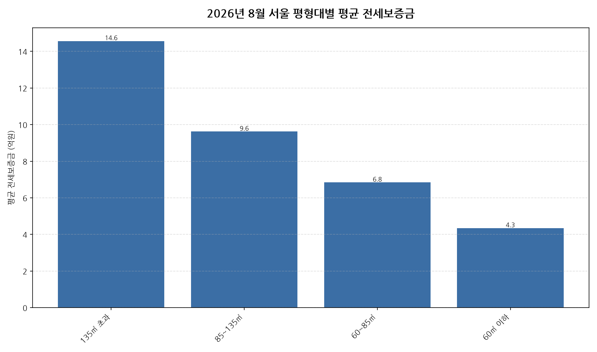

공공데이터포털의 국토교통부 아파트 전월세 실거래자료를 파이썬으로 직접 수집·분석해
2026년 8월 서울 아파트 순수 전세 시장 흐름을 정리했습니다.

## 분석 방법

- 데이터 출처: [국토교통부 아파트 전월세 실거래자료](https://www.data.go.kr/data/15126474/openapi.do) (공공데이터포털 Open API)
- 분석 대상: 서울 25개 자치구, 2026년 8월 신고 기준 순수 전세 계약
- 비교 기준월: 2026년 7월 (전월 대비 증감률 계산용)
- 실거래 신고는 계약 후 30일 이내에 이루어지므로, 최근월 데이터는 이후 계속 소폭 갱신될 수 있습니다.

## 2026년 8월 서울 아파트 평형대별 전세가 분석 · 평형대별 평균 전세보증금

| 평형대 | 평균 전세보증금 | 중위 전세보증금 | 거래건수 |
|---|---:|---:|---:|
| 135㎡ 초과 | 14.6 | 13.6 | 170 |
| 85~135㎡ | 9.6 | 8.7 | 843 |
| 60~85㎡ | 6.8 | 6.5 | 3058 |
| 60㎡ 이하 | 4.3 | 4.0 | 3349 |

## 2026년 8월 서울 아파트 평형대별 전세가 분석 · 평형대별 인사이트

- 2026년 8월 서울 아파트 순수 전세 평균 전세보증금은 약 6.2억원으로, 전월 대비 2.9% 하락했습니다.
- 4개 평형대 구간 중 평균 전세보증금이 가장 높은 구간은 135㎡ 초과(약 14.6억원)이었고, 가장 낮은 구간은 60㎡ 이하(약 4.3억원)이었습니다.
- 거래량 기준으로는 60㎡ 이하에서 3349건으로 가장 활발하게 순수 전세 계약이 체결됐습니다.
- 2026년 8월 서울에서 신고된 순수 전세 계약은 총 7420건입니다 (월세를 낀 반전세/월세 계약은 제외).
