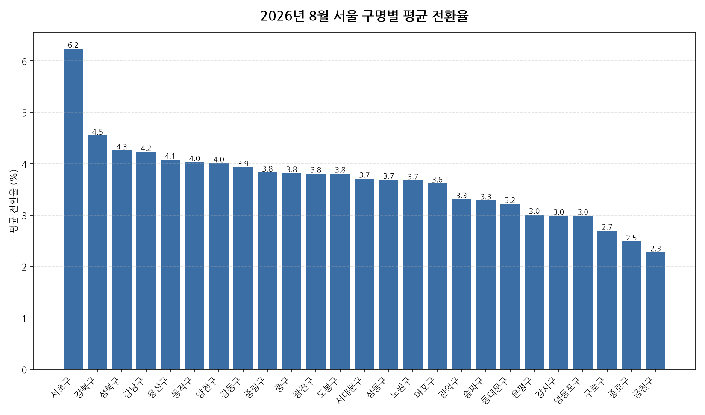

공공데이터포털의 국토교통부 아파트 전월세 실거래자료를 파이썬으로 직접 수집·분석해
2026년 8월 서울 아파트 반전세(전월세 전환) 시장 흐름을 정리했습니다.

## 분석 방법

- 데이터 출처: [국토교통부 아파트 전월세 실거래자료](https://www.data.go.kr/data/15126474/openapi.do) (공공데이터포털 Open API)
- 분석 대상: 서울 25개 자치구, 2026년 8월 신고 기준 반전세(전월세 전환) 계약
- 비교 기준월: 2026년 7월 (전월 대비 증감률 계산용)
- 실거래 신고는 계약 후 30일 이내에 이루어지므로, 최근월 데이터는 이후 계속 소폭 갱신될 수 있습니다.
- 전월세 전환율은 실제 시세 대신 같은 자치구·같은 달의 순수 전세 평균 보증금을 기준가로 삼아 추정한 값입니다(연 환산 %).

## 2026년 8월 서울 아파트 전월세 전환율 분석 · 자치구별 평균 전환율

| 자치구 | 평균 전환율 | 중위 전환율 | 거래건수 |
|---|---:|---:|---:|
| 서초구 | 6.2 | 4.9 | 260 |
| 강북구 | 4.5 | 3.1 | 89 |
| 성북구 | 4.3 | 3.7 | 167 |
| 강남구 | 4.2 | 2.7 | 442 |
| 용산구 | 4.1 | 3.1 | 174 |
| 동작구 | 4.0 | 3.1 | 219 |
| 양천구 | 4.0 | 2.9 | 218 |
| 강동구 | 3.9 | 2.9 | 340 |
| 중랑구 | 3.8 | 2.4 | 310 |
| 중구 | 3.8 | 2.8 | 121 |
| 광진구 | 3.8 | 2.6 | 111 |
| 도봉구 | 3.8 | 3.1 | 113 |
| 서대문구 | 3.7 | 2.8 | 191 |
| 성동구 | 3.7 | 2.1 | 318 |
| 노원구 | 3.7 | 3.2 | 475 |
| 마포구 | 3.6 | 2.5 | 347 |
| 관악구 | 3.3 | 2.4 | 208 |
| 송파구 | 3.3 | 1.7 | 517 |
| 동대문구 | 3.2 | 1.9 | 295 |
| 은평구 | 3.0 | 1.1 | 273 |
| 강서구 | 3.0 | 1.5 | 445 |
| 영등포구 | 3.0 | 2.2 | 266 |
| 구로구 | 2.7 | 2.9 | 552 |
| 종로구 | 2.5 | 1.8 | 90 |
| 금천구 | 2.3 | 1.6 | 216 |

## 2026년 8월 서울 아파트 전월세 전환율 분석 · 자치구별 인사이트

- 2026년 8월 서울 아파트 반전세(전월세 전환) 평균 전환율은 약 3.6%으로, 전월 대비 0.1% 하락했습니다.
- 25개 자치구 중 평균 전환율이 가장 높은 곳은 서초구(약 6.2%)이었고, 가장 낮은 곳은 금천구(약 2.3%)이었습니다.
- 거래량 기준으로는 구로구에서 552건으로 가장 활발하게 반전세(전월세 전환) 계약이 체결됐습니다.
- 2026년 8월 서울에서 신고된 반전세(전월세 전환) 계약은 총 6757건입니다 (같은 자치구·같은 달 순수 전세 평균가 대비 환산한 추정치이며, 전환율이 0% 이하이거나 30%를 넘는 이상치는 제외).
