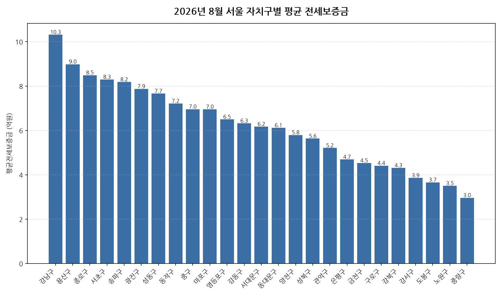

공공데이터포털의 국토교통부 아파트 전월세 실거래자료를 파이썬으로 직접 수집·분석해
2026년 8월 서울 아파트 순수 전세 시장 흐름을 정리했습니다.

## 분석 방법

- 데이터 출처: [국토교통부 아파트 전월세 실거래자료](https://www.data.go.kr/data/15126474/openapi.do) (공공데이터포털 Open API)
- 분석 대상: 서울 25개 자치구, 2026년 8월 신고 기준 순수 전세 계약
- 비교 기준월: 2026년 7월 (전월 대비 증감률 계산용)
- 실거래 신고는 계약 후 30일 이내에 이루어지므로, 최근월 데이터는 이후 계속 소폭 갱신될 수 있습니다.

## 자치구별 평균전세보증금

| 자치구 | 평균전세보증금 | 중위전세보증금 | 거래건수 |
|---|---:|---:|---:|
| 강남구 | 10.3 | 9.5 | 521 |
| 용산구 | 9.0 | 8.1 | 152 |
| 종로구 | 8.5 | 7.2 | 36 |
| 서초구 | 8.3 | 7.0 | 535 |
| 송파구 | 8.2 | 7.5 | 548 |
| 광진구 | 7.9 | 7.1 | 112 |
| 성동구 | 7.7 | 7.5 | 271 |
| 동작구 | 7.2 | 7.0 | 261 |
| 중구 | 7.0 | 7.0 | 98 |
| 마포구 | 7.0 | 7.0 | 356 |
| 영등포구 | 6.5 | 6.2 | 342 |
| 강동구 | 6.3 | 6.0 | 350 |
| 서대문구 | 6.2 | 6.0 | 225 |
| 동대문구 | 6.1 | 6.3 | 207 |
| 양천구 | 5.8 | 5.6 | 363 |
| 성북구 | 5.6 | 5.5 | 253 |
| 관악구 | 5.2 | 5.2 | 149 |
| 은평구 | 4.7 | 4.8 | 309 |
| 금천구 | 4.5 | 4.3 | 66 |
| 구로구 | 4.4 | 4.3 | 241 |
| 강북구 | 4.3 | 4.3 | 89 |
| 강서구 | 3.9 | 2.7 | 757 |
| 도봉구 | 3.7 | 3.8 | 165 |
| 노원구 | 3.5 | 3.1 | 551 |
| 중랑구 | 3.0 | 2.4 | 306 |

## 이번 달 인사이트

- 2026년 8월 서울 아파트 순수 전세 평균 전세보증금은 약 6.2억원으로, 전월 대비 3.2% 하락했습니다.
- 25개 자치구 중 평균 전세보증금이 가장 높은 곳은 강남구(약 10.3억원)이었고, 가장 낮은 곳은 중랑구(약 3.0억원)이었습니다.
- 거래량 기준으로는 강서구에서 757건으로 가장 활발하게 순수 전세 계약이 체결됐습니다.
- 2026년 8월 서울에서 신고된 순수 전세 계약은 총 7263건입니다 (월세를 낀 반전세/월세 계약은 제외, 전용면적 기준 단순 비교).

---

이런 데이터를 직접 파이썬으로 분석해보고 싶으신 분들을 위해, 공공데이터포털 아파트 매매/전월세 데이터를 분석하는 방법을 담은 전자책 《파이썬을 활용한 부동산 시장 분석_아파트편》을 준비했어요. 2026년 데이터를 기준으로 다루고 있고, 교보문고에서 만나보실 수 있어요: https://ebook-product.kyobobook.co.kr/dig/epd/ebook/480D250151380
