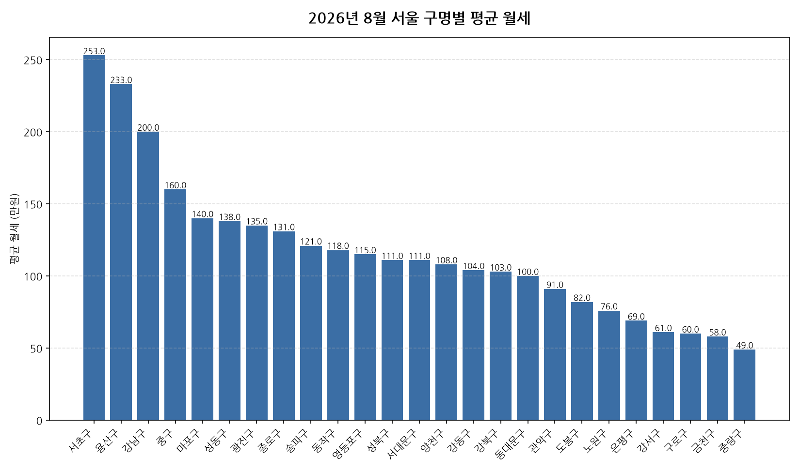

공공데이터포털의 국토교통부 아파트 전월세 실거래자료를 파이썬으로 직접 수집·분석해
2026년 8월 서울 아파트 월세(반전세 포함) 시장 흐름을 정리했습니다.

## 분석 방법

- 데이터 출처: [국토교통부 아파트 전월세 실거래자료](https://www.data.go.kr/data/15126474/openapi.do) (공공데이터포털 Open API)
- 분석 대상: 서울 25개 자치구, 2026년 8월 신고 기준 월세(반전세 포함) 계약
- 비교 기준월: 2026년 7월 (전월 대비 증감률 계산용)
- 실거래 신고는 계약 후 30일 이내에 이루어지므로, 최근월 데이터는 이후 계속 소폭 갱신될 수 있습니다.

## 자치구별 평균 월세

| 자치구 | 평균 월세 | 중위 월세 | 거래건수 |
|---|---:|---:|---:|
| 서초구 | 253.0 | 177.0 | 341 |
| 용산구 | 233.0 | 163.0 | 190 |
| 강남구 | 200.0 | 150.0 | 523 |
| 중구 | 160.0 | 138.0 | 128 |
| 마포구 | 140.0 | 110.0 | 380 |
| 성동구 | 138.0 | 75.0 | 329 |
| 광진구 | 135.0 | 91.0 | 117 |
| 종로구 | 131.0 | 123.0 | 94 |
| 송파구 | 121.0 | 80.0 | 578 |
| 동작구 | 118.0 | 94.0 | 235 |
| 영등포구 | 115.0 | 82.0 | 288 |
| 성북구 | 111.0 | 90.0 | 182 |
| 서대문구 | 111.0 | 85.0 | 203 |
| 양천구 | 108.0 | 80.0 | 258 |
| 강동구 | 104.0 | 78.0 | 374 |
| 강북구 | 103.0 | 90.0 | 97 |
| 동대문구 | 100.0 | 80.0 | 307 |
| 관악구 | 91.0 | 75.0 | 220 |
| 도봉구 | 82.0 | 80.0 | 115 |
| 노원구 | 76.0 | 75.0 | 506 |
| 은평구 | 69.0 | 36.0 | 298 |
| 강서구 | 61.0 | 43.0 | 500 |
| 구로구 | 60.0 | 53.0 | 563 |
| 금천구 | 58.0 | 52.0 | 220 |
| 중랑구 | 49.0 | 40.0 | 375 |

## 이번 달 인사이트

- 2026년 8월 서울 아파트 월세(반전세 포함) 평균 월세는 약 114.2만원으로, 전월 대비 5.2% 하락했습니다.
- 25개 자치구 중 평균 월세가 가장 높은 곳은 서초구(약 253.0만원)이었고, 가장 낮은 곳은 중랑구(약 49.0만원)이었습니다.
- 거래량 기준으로는 송파구에서 578건으로 가장 활발하게 월세(반전세 포함) 계약이 체결됐습니다.
- 2026년 8월 서울에서 신고된 월세(반전세 포함) 계약은 총 7421건입니다 (순수 전세 계약은 제외).

---

이런 데이터를 직접 파이썬으로 분석해보고 싶으신 분들을 위해, 공공데이터포털 아파트 매매/전월세 데이터를 분석하는 방법을 담은 전자책 《파이썬을 활용한 부동산 시장 분석_아파트편》을 준비했어요. 2026년 데이터를 기준으로 다루고 있고, 교보문고에서 만나보실 수 있어요: https://ebook-product.kyobobook.co.kr/dig/epd/ebook/480D250151380
